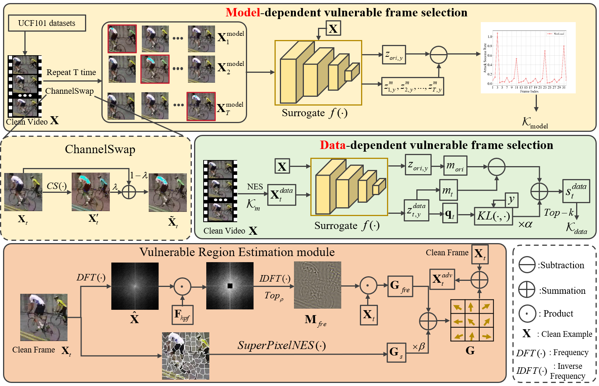
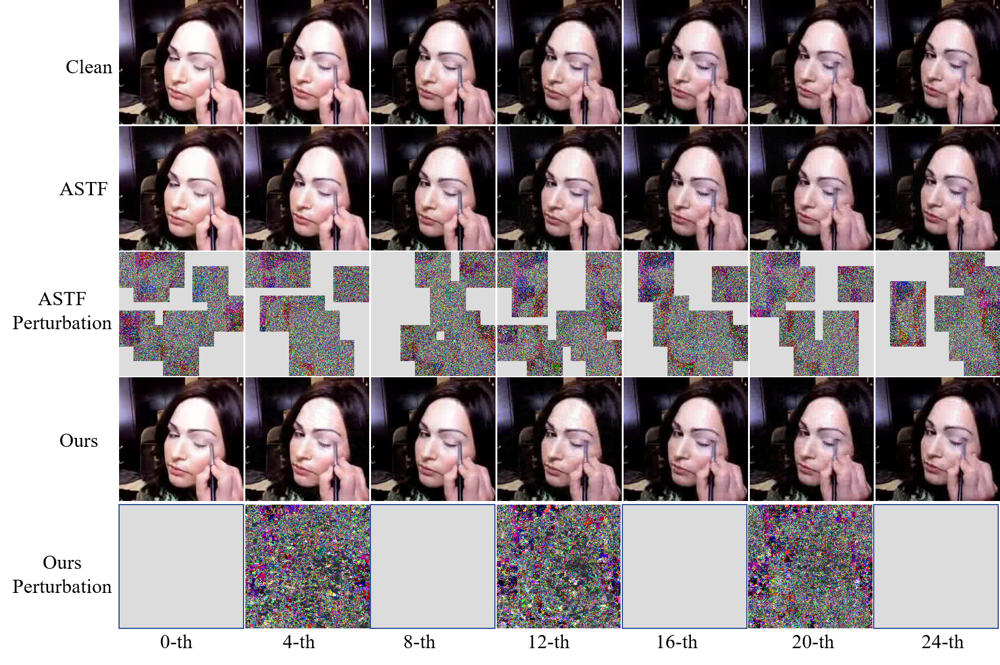

# SVRE_Query-based Attack for Action Recognition

This repository is official PyTorch implementation code:  **Spatiotemporal Vulnerable Frame and Region Estimation for Video Query Attack**.  

## **Abstract**

Video classification models using neural networks are highly vulnerable to adversarial examples, where human visually-imperceptible perturbations added to clean videos can lead to incorrect predictions. This incurs the security issue which can be detected by adversarail attacker. In the black-box setting, video query attacks are popular but require significantly higher computations due to the additional temporal coherence in videos compared to images. Existing methods attempt to identify data-aware partial frames while overlooking model architecture difference, leading to incorrect estimation of vulnerable frames. Meanwhile, they either focus on the foreground objects or simply add perturbations to the entire frame, which undermines the importance of the background region. To address these issues, this paper proposes the **Spatiotemporal Vulnerable frame and Region Estimation (SVRE)** framework. Specifically, we design a both data-aware and model-aware Vulnerable Frame Detection (VFD) module, which employs model-aware batch-frame augmentation with channel swap and data-aware single-frame perturbation to compute corresponding frame scores. Those frames with higher score are regarded as more vulnerable. Meanwhile, we design a vulnerable Region Estimation (VRE) module that adopts the gradient fusion of high-pass  filter frames and superpixels with natural evolution strategy. Here, we update the mask ratio in high-pass filter and the number of superpixels, according to the logits variation of recent attack queries. Experimental results on three video benchmarks, including HMDB51, UCF101, and Kinetics400, demonstrate that the proposed method achieves state-of-the-art performance in terms of attack success rate, query efficiency, and mean absolute perturbation.



## Table of Contents

\- [Requirements](#requirements)
\- [Dataset](#dataset)
\- [Models](#models)
\- [Attack](#attack)
\- [Quantitative results on UCF101](#quantitative-results-on-ucf101)
\- [Qualitative results](#qualitative-results)
\- [Citation](#citation)
\- [Acknowledgement](#acknowledgement)
\- [License](#license)

## **Requirements**

The main runtime environment of the code:

```python
 python 3.7
 Pytorch 1.8.0
 CUDA 11.4
```

Install the libraries using requirements.txt as:

```python
 conda env create -f SVRE.yml
```

## **Dataset**

For action recognition, the used datasets are sampled from UCF101 and Kinetics-400. Download attacked datasets from [here](https://drive.google.com/drive/folders/1O4XyLw37WqGKqFvWFaE2ps5IAD_shSpG?usp=sharing). 
Change the **UCF_DATA_ROOT** and **Kinetic_DATA_ROOT** of utils.py into your dataset path.

Then you should prepare the datasets as follows:

```python
├──datasets
    ├──UCF101-EXAMPLE
    ├──Kinetics400-EXAMPLE
```

## Models

For action recognition, Non-local, SlowFast, TPN with ResNet-50 and ResNet-101 as backbones are used here.

#### UCF101

We fine-tune video models on UCF101.Download checkpoint files from [here](https://drive.google.com/drive/folders/10KOlWdi5bsV9001uL4Bn1T48m9hkgsZ2?usp=sharing).
Change the **UCF_MODEL_ROOT** of utils.py into your checkpoint path.

#### Kinetics-400

We use pretrained models on Kinetics-400 from [gluoncv](https://cv.gluon.ai/model_zoo/action_recognition.html) to conduct experiments.

#### Attack Setting

you can check ./configs/config.py

## Attack

To perform the query attack, run the following command:

```
python Untarget_attack_ucf.py
```

## Quantitative results on UCF101

The following table reports quantitative attack results on UCF101. MAP denotes mean absolute perturbation, QN denotes query number, and FR denotes fooling rate.

| Target | Attacks | Venue | Untargeted MAP↓ | Untargeted QN↓ | Untargeted FR↑ | Targeted MAP↓ | Targeted QN↓ | Targeted FR↑ |
|---|---|---:|:--:|:--:|:--:|:--:|:--:|:--:|
| NL | Heuristic | AAAI’20 | 5.927 | 13526 | 28% | Fail Attack | - | - |
|  | GEO-TRAP | NeurIPS’21 | 5.842 | 9412 | 48% | 5.969 | 21604 | 46% |
|  | ASTF | TPAMI’23 | 2.437 | 7164 | 61% | 2.671 | 15062 | 58% |
|  | CLVA | TIFS’24 | 2.157 | 6583 | 64% | 2.338 | 14069 | 61% |
|  | FDP | ACMMM’25 | 3.932 | 6827 | 68% | 4.168 | 14692 | 64% |
|  | **Ours** | - | **2.098** | **6313** | **70%** | **2.318** | **13265** | **66%** |
| SlowFast | Heuristic | AAAI’20 | 5.932 | 14282 | 33% | Fail Attack | - | - |
|  | GEO-TRAP | NeurIPS’21 | 5.743 | 10761 | 42% | 5.981 | 24063 | 38% |
|  | ASTF | TPAMI’23 | 2.595 | 8093 | 54% | 2.739 | 18707 | 53% |
|  | CLVA | TIFS’24 | 2.251 | 7917 | 59% | 2.404 | 15357 | 57% |
|  | FDP | ACMMM’25 | 4.344 | 7827 | 64% | 4.572 | 16591 | 60% |
|  | **Ours** | - | **2.012** | **7648** | **66%** | **2.169** | **14341** | **63%** |
| TPN | Heuristic | AAAI’20 | 6.032 | 14680 | 17% | Fail Attack | - | - |
|  | GEO-TRAP | NeurIPS’21 | 5.956 | 12953 | 24% | 6.216 | 26737 | 19% |
|  | ASTF | TPAMI’23 | 2.426 | 10387 | 39% | 2.619 | 20094 | 39% |
|  | CLVA | TIFS’24 | 2.398 | 9867 | 42% | 2.437 | 18492 | 40% |
|  | FDP | ACMMM’25 | 3.828 | 9726 | 45% | 4.063 | 20158 | 41% |
|  | **Ours** | - | **2.143** | **9306** | **48%** | **2.328** | **17734** | **47%** |
| C3D | Heuristic | AAAI’20 | 6.127 | 13874 | 30% | Fail Attack | - | - |
|  | GEO-TRAP | NeurIPS’21 | 6.013 | 9904 | 44% | 6.097 | 23034 | 39% |
|  | ASTF | TPAMI’23 | 2.402 | 7830 | 56% | 2.745 | 17420 | 55% |
|  | CLVA | TIFS’24 | 2.201 | 7342 | 64% | 2.329 | 16943 | 61% |
|  | FDP | ACMMM’25 | 3.714 | 7568 | 67% | 3.947 | 15824 | 63% |
|  | **Ours** | - | **2.094** | **7190** | **68%** | **2.239** | **16609** | **65%** |
| TimeSformer | Heuristic | AAAI’20 | 5.965 | 14832 | 21% | Fail Attack | - | - |
|  | GEO-TRAP | NeurIPS’21 | 5.953 | 13170 | 28% | 6.238 | 25165 | 25% |
|  | ASTF | TPAMI’23 | 2.620 | 10748 | 40% | 2.519 | 20031 | 39% |
|  | CLVA | TIFS’24 | 2.235 | 9811 | 41% | 2.367 | 20637 | 41% |
|  | FDP | ACMMM’25 | 3.891 | 10124 | 43% | 4.122 | 21483 | 39% |
|  | **Ours** | - | **2.116** | **9590** | **45%** | **2.307** | **19773** | **43%** |
| VideoSwin | Heuristic | AAAI’20 | 5.913 | 14281 | 23% | Fail Attack | - | - |
|  | GEO-TRAP | NeurIPS’21 | 5.862 | 12419 | 31% | 6.151 | 26835 | 27% |
|  | ASTF | TPAMI’23 | 2.518 | 9612 | 39% | 2.620 | 19259 | 38% |
|  | CLVA | TIFS’24 | 2.276 | 9722 | 42% | 2.384 | 19307 | 39% |
|  | FDP | ACMMM’25 | 3.962 | 9481 | 44% | 4.186 | 19874 | 40% |
|  | **Ours** | - | **2.192** | **8707** | **47%** | **2.362** | **18430** | **45%** |

## Qualitative results



## **Citation**

```
@inproceedings{--svre,
  author     ={},
  title      ={Spatiotemporal Vulnerable Frame and Region Estimation for Video Query Attack},
  booktitle  ={},
  pages      ={},
  year       ={}
}
```

## Contact

If you have any questions, please feel free to contact Mr. Bo Pang via email([pbcs@hdu.edu.cn](mailto:pbcs@hdu.edu.cn)).

## **Acknowledgement**

We would like to thank the authors of [TT] (https://github.com/zhipeng-wei/TT), which has significantly accelerated the development of our SVRE Method.

## License

This project is licensed under the MIT License. See the [LICENSE file](https://github.com/A4Bio/E3-CryoFold/blob/main/LICENSE) for details.
